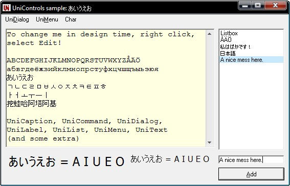



## UniControls: Unicode aware controls \[2008\-06\-19\]

### Description

It is hard to get Unicode in VB6. The biggest reason is the nowhere-to-be-found support in any of the native controls. In the past few years people have been mostly forced to commercial solutions or to move to another language. With UniControls I try to change this by providing some of the most essential tools for working with Unicode. 

----

This is the summer release. What you find here are a few powerful controls, and some that are still in an earlier level of development, yet useful for many tasks. Included: UniCaption, UniCommand, UniDialog, UniLabel, UniList, UniMenu &amp; UniText, with some additional bonus code. 

----

NOTE: despite these controls using SelfSub, SelfHook and SelfCallback by Paul Caton and LaVolpe, not all of these controls are Stop button safe. This is because of UserControl's limited OLE interface, which has forced to some IOleInActivePlaceObject hacking, for which there currently is no perfectly IDE safe solution. If I didn't use it, I would have to use complex hooking to capture Enter, Escape, Tabulator, arrow keys and other navigation keys. 

----

Hopefully you enjoy these controls!
 
### More Info
 

             |
---                |---
**Submitted On**   |2008-06-19 06:59:52
**By**             |[Vesa Piittinen](https://github.com/Planet-Source-Code/PSCIndex/blob/master/ByAuthor/vesa-piittinen.md)
**Level**          |Advanced
**User Rating**    |4.9 (94 globes from 19 users)
**Compatibility**  |VB 6\.0
**Category**       |[Custom Controls/ Forms/  Menus](https://github.com/Planet-Source-Code/PSCIndex/blob/master/ByCategory/custom-controls-forms-menus__1-4.md)
**World**          |[Visual Basic](https://github.com/Planet-Source-Code/PSCIndex/blob/master/ByWorld/visual-basic.md)
**Archive File**   |[UniControl2117366192008\.zip](https://github.com/Planet-Source-Code/vesa-piittinen-unicontrols-unicode-aware-controls-2008-06-19__1-69738/archive/master.zip)

